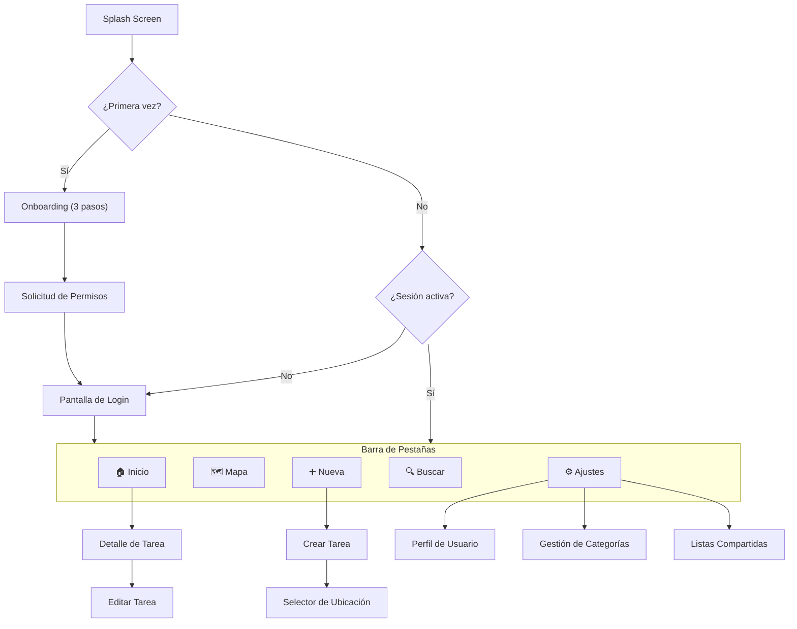

# 🎨 GeoTask — Especificación de Interfaz de Usuario (UX/UI)

> **Documento destinado al equipo de diseño UX/UI**
> Contiene toda la información necesaria para diseñar la interfaz completa de la aplicación.

---

## 1. Descripción del Producto

**GeoTask** es una app móvil (iOS/Android) que permite crear tareas vinculadas a ubicaciones geográficas. Cuando el usuario se acerca a un lugar donde tiene un mandado pendiente, la app le avisa mediante una notificación push.

### 1.1 Público Objetivo

| Perfil | Descripción |
|--------|-------------|
| **Primario** | Adultos 25-55 años, vida urbana activa, múltiples recados diarios |
| **Secundario** | Parejas/familias que comparten tareas domésticas y compras |
| **Terciario** | Profesionales que visitan clientes/proveedores en distintas localizaciones |

### 1.2 Contexto de Uso

- Usado **en movimiento** (caminando, en transporte, en coche)
- Interacciones **breves y rápidas** (crear tarea en <30 seg)
- Funciona **en segundo plano** la mayor parte del tiempo (notificaciones)
- Se usa con **una sola mano** frecuentemente
- Condiciones de **iluminación variable** (exterior, sol directo)

---

## 2. Mapa de Navegación

### 2.1 Flujo General de la Aplicación



### 2.2 Estructura de Pestañas (Tab Bar)

| Posición | Pestaña | Icono | Descripción |
|----------|---------|-------|-------------|
| 1 | **Inicio** | `home` | Lista de tareas pendientes |
| 2 | **Mapa** | `map` | Vista geográfica de todas las tareas |
| 3 | **Nueva** *(destacado)* | `plus-circle` | Crear tarea (botón central prominente) |
| 4 | **Buscar** | `search` | Búsqueda por zona geográfica |
| 5 | **Ajustes** | `settings` | Configuración y perfil |

> El botón central "Nueva" debe ser visualmente más grande y destacado (estilo FAB integrado en el tab bar).

---

## 3. Pantallas — Especificación Detallada

---

### 3.0 🚀 Splash Screen

**Propósito:** Carga inicial de la app.

| Elemento | Detalle |
|----------|---------|
| Logo | Logotipo de GeoTask centrado con animación sutil (scale-in + fade) |
| Fondo | Gradiente del color primario |
| Duración | 1.5-2 segundos máximo |
| Indicador | Barra de progreso mínima o spinner sutil |

---

### 3.1 📖 Onboarding (Solo primer uso)

**Propósito:** Explicar la propuesta de valor en 3 pantallas deslizables.

#### Pantalla 1: "Tus mandados, en el mapa"
- **Ilustración:** Persona caminando por la ciudad con iconos de tareas flotando sobre establecimientos
- **Texto principal:** "Crea tareas vinculadas a lugares reales"
- **Texto secundario:** "Supermercado, banco, farmacia... vincula cada mandado a su ubicación"

#### Pantalla 2: "Te avisamos cuando estés cerca"
- **Ilustración:** Teléfono mostrando notificación con un mapa y radio circular
- **Texto principal:** "Notificaciones por proximidad"
- **Texto secundario:** "Cuando pases cerca de un sitio donde tienes algo pendiente, te lo recordamos"

#### Pantalla 3: "Organiza por zonas"
- **Ilustración:** Mapa con clusters de colores por barrios
- **Texto principal:** "Planifica tus salidas"
- **Texto secundario:** "Consulta qué tienes pendiente en cada zona antes de salir"

**Controles:**
- Indicador de página (3 dots)
- Botón "Siguiente" en pantallas 1 y 2
- Botón "Comenzar" en pantalla 3
- Enlace "Saltar" en esquina superior derecha

---

### 3.2 🔑 Pantalla de Login / Registro

**Propósito:** Autenticación del usuario. Inicialmente opcional (se puede usar sin cuenta), obligatoria para listas compartidas.

#### Elementos UI:

| Elemento | Tipo | Detalle |
|----------|------|---------|
| Logo | Imagen | Logo de GeoTask + tagline |
| Título | H1 | "Bienvenido a GeoTask" |
| Subtítulo | Párrafo | "Gestiona tus mandados de forma inteligente" |
| Email | Input text | Placeholder: "tu@email.com", teclado email |
| Contraseña | Input password | Con icono ojo para mostrar/ocultar |
| Botón Login | Botón primario | "Iniciar Sesión" |
| Separador | Línea | "— o continúa con —" |
| Google Sign-In | Botón social | Icono Google + "Continuar con Google" |
| Apple Sign-In | Botón social | Icono Apple + "Continuar con Apple" (solo iOS) |
| Registro | Enlace | "¿No tienes cuenta? Regístrate" |
| Modo invitado | Enlace | "Continuar sin cuenta" (acceso limitado) |
| Olvidé contraseña | Enlace | "¿Olvidaste tu contraseña?" |

#### Pantalla de Registro (modal o navegación):

| Campo | Tipo | Validación |
|-------|------|------------|
| Nombre | Input text | Requerido, min 2 caracteres |
| Email | Input email | Requerido, formato email válido |
| Contraseña | Input password | Min 8 caracteres, 1 mayúscula, 1 número |
| Confirmar contraseña | Input password | Debe coincidir |
| Aceptar términos | Checkbox | Requerido |
| Botón | Primario | "Crear cuenta" |

#### Estados de error:
- Email no registrado → "Este email no está registrado"
- Contraseña incorrecta → "Contraseña incorrecta"
- Email ya existe → "Este email ya tiene una cuenta"
- Sin conexión → "Comprueba tu conexión a internet"

---

### 3.3 🔐 Solicitud de Permisos

**Propósito:** Pedir permisos nativos con contexto explicativo ANTES de que el sistema muestre su diálogo.

#### Permiso 1: Ubicación

| Elemento | Detalle |
|----------|---------|
| Icono | 📍 animado |
| Título | "GeoTask necesita tu ubicación" |
| Explicación | "Para avisarte cuando estés cerca de tus tareas pendientes, necesitamos acceder a tu ubicación incluso en segundo plano" |
| Beneficio visual | Mini-ilustración: mapa con notificación apareciendo |
| Botón primario | "Permitir ubicación" → dispara diálogo nativo |
| Botón secundario | "Ahora no" (la app funciona limitada) |

#### Permiso 2: Notificaciones

| Elemento | Detalle |
|----------|---------|
| Icono | 🔔 animado |
| Título | "¿Activamos las alertas?" |
| Explicación | "Te avisaremos con una notificación cuando pases cerca de un mandado pendiente" |
| Botón primario | "Activar notificaciones" → dispara diálogo nativo |
| Botón secundario | "Más tarde" |

---

### 3.4 🏠 Pantalla Inicio (Lista de Tareas)

**Propósito:** Vista principal con todas las tareas del usuario, priorizando las pendientes.

#### Estructura de layout:

```
┌──────────────────────────────────────┐
│ [Cabecera]                           │
│  "Hola, {nombre}" + avatar           │
│  Resumen: "5 tareas pendientes"      │
├──────────────────────────────────────┤
│ [Filtros horizontales - scroll]      │
│  [Todas] [Compras] [Bancos] [Papeleo]│
├──────────────────────────────────────┤
│ [Sección: Tareas cercanas]  📍       │
│  ┌────────────────────────────┐      │
│  │ 🛒 Comprar leche           │      │
│  │    Mercadona Nervión        │      │
│  │    📍 350m  ⏰ Abierto      │      │
│  └────────────────────────────┘      │
│  ┌────────────────────────────┐      │
│  │ 🏦 Ingresar cheque         │      │
│  │    BBVA Av. Constitución   │      │
│  │    📍 1.2km  ⏰ Cierra 14h │      │
│  └────────────────────────────┘      │
├──────────────────────────────────────┤
│ [Sección: Otras pendientes]          │
│  ┌────────────────────────────┐      │
│  │ 💊 Recoger receta          │      │
│  │    Farmacia Cruz Verde     │      │
│  │    📍 4.8km                │      │
│  └────────────────────────────┘      │
├──────────────────────────────────────┤
│         [Tab Bar inferior]           │
│  🏠   🗺️   [➕]   🔍   ⚙️          │
└──────────────────────────────────────┘
```

#### Componente: Tarjeta de Tarea

| Elemento | Detalle |
|----------|---------|
| Icono categoría | Círculo con color + icono de la categoría |
| Título | Nombre de la tarea (max 1 línea, truncar con ...) |
| Lugar | Nombre del establecimiento o dirección (color gris) |
| Distancia | Badge con distancia desde ubic. actual (📍 350m) |
| Estado horario | Badge: "Abierto" (verde) / "Cerrado" (rojo) / "Cierra a las 14h" (naranja) |
| Prioridad | Indicador lateral: barra de color (rojo/amarillo/verde) |
| Fecha límite | Si existe: "Vence mañana" con icono reloj |

#### Interacciones:

| Gesto | Acción |
|-------|--------|
| Tap en tarjeta | Navegar al detalle de la tarea |
| Swipe derecha | Marcar como completada (animación check verde) |
| Swipe izquierda | Eliminar (con confirmación) |
| Pull-to-refresh | Actualizar distancias y horarios |
| Long press | Menú contextual: Editar, Compartir, Eliminar |

#### Estado vacío:
- Ilustración amigable (persona relajada sin tareas)
- Texto: "¡Todo al día! No tienes mandados pendientes"
- Botón: "Crear primera tarea"

---

### 3.5 🗺️ Pantalla Mapa

**Propósito:** Visualización geográfica de todas las tareas sobre un mapa interactivo.

#### Estructura:

```
┌──────────────────────────────────────┐
│ [Barra superior flotante]            │
│  [🔍 Buscar zona...]  [Filtros 🏷️]  │
├──────────────────────────────────────┤
│                                      │
│          [MAPA FULL SCREEN]          │
│                                      │
│     🛒(verde)    🏦(naranja)         │
│                                      │
│              📍(usuario)             │
│                  ◯ radio             │
│        💊(rojo)                      │
│                                      │
│                       📦(morado)     │
│                                      │
├──────────────────────────────────────┤
│ [Bottom Sheet arrastrable]           │
│  Peek: "4 tareas en esta zona"       │
│  Expandido: Lista de tareas visibles │
├──────────────────────────────────────┤
│  [Botón flotante: Mi ubicación 📍]   │
├──────────────────────────────────────┤
│         [Tab Bar inferior]           │
└──────────────────────────────────────┘
```

#### Elementos del Mapa:

| Elemento | Visual | Comportamiento |
|----------|--------|---------------|
| Marcador de tarea | Pin con icono y color de categoría | Tap → callout con resumen |
| Marcador usuario | Punto azul pulsante (estándar) | Se actualiza en tiempo real |
| Radio geocerca | Círculo semi-transparente del color de categoría | Solo visible al hacer zoom suficiente |
| Cluster | Círculo con número (ej. "3") | Tap → zoom para separar |
| Callout de tarea | Mini-card sobre marcador | Tap → navegar al detalle |

#### Callout (burbuja al tocar marcador):
- Título de la tarea
- Dirección
- Distancia
- Estado (Abierto/Cerrado)
- Botón "Ver detalle →"

#### Bottom Sheet (panel inferior arrastrable):
- **Estado collapsed:** Solo muestra "X tareas en esta zona"
- **Estado medio:** Lista scrollable de tareas visibles en el viewport del mapa
- **Estado expandido:** Lista completa con filtros

---

### 3.6 ➕ Pantalla Crear Tarea

**Propósito:** Formulario para crear una nueva tarea geolocalizada.

#### Flujo de creación (3 pasos con stepper visual):

**Paso 1: ¿Qué necesitas hacer?**

| Campo | Tipo | Validación | Placeholder |
|-------|------|------------|-------------|
| Título | Input text | Requerido, max 100 chars | "Ej: Comprar leche" |
| Descripción | Textarea | Opcional, max 500 chars | "Añade detalles opcionales..." |
| Categoría | Selector visual | Requerido | Grid de iconos con colores |
| Prioridad | Selector 3 opciones | Default: Media | 🔴 Alta / 🟡 Media / 🟢 Baja |
| Fecha límite | Date picker | Opcional | "Sin fecha límite" |
| Foto | Botón cámara/galería | Opcional | Previsualización de imagen |

**Paso 2: ¿Dónde?**

| Elemento | Tipo | Detalle |
|----------|------|---------|
| Buscador | Input con autocompletado | Google Places Autocomplete |
| Mapa | Mapa interactivo | Se puede tocar para colocar pin |
| Pin | Marcador arrastrable | Se posiciona al buscar o al tocar |
| Dirección | Texto auto-rellenado | Se completa con geocoding inverso |
| Nombre lugar | Input text | Auto-rellenado desde Places, editable |
| Resultado búsqueda | Lista desplegable | Nombre, dirección, distancia, icono tipo |

**Paso 3: ¿Con qué radio?**

| Elemento | Tipo | Detalle |
|----------|------|---------|
| Slider de radio | Range slider | 100m — 2000m, pasos de 50m |
| Valor actual | Texto grande | "500 metros" |
| Preview en mapa | Círculo animado | Se actualiza en tiempo real al mover slider |
| Radios sugeridos | Chips | "200m (a pie)" "500m (calle)" "1km (barrio)" |
| Geocerca activa | Toggle switch | "Activar alertas de proximidad" |

**Botones de acción:**
- "Anterior" / "Siguiente" en pasos 1-2
- "Crear tarea" (botón primario) en paso 3
- "Cancelar" (enlace en cabecera)

**Feedback de creación:** Animación de éxito (check + confetti sutil) → "¡Tarea creada!" → Volver a inicio

---

### 3.7 📋 Pantalla Detalle de Tarea

**Propósito:** Ver toda la información de una tarea y realizar acciones sobre ella.

#### Layout:

```
┌──────────────────────────────────────┐
│ [← Volver]              [⋮ Menú]    │
├──────────────────────────────────────┤
│ [Mini-mapa con marcador y radio]     │
│  Altura: ~200px, no interactivo      │
│  Tap → abrir en mapa completo       │
├──────────────────────────────────────┤
│ [Badge categoría] [Badge prioridad]  │
│                                      │
│ Título de la tarea          (H1)     │
│ 📍 Dirección completa               │
│ 🏪 Nombre del establecimiento       │
├──────────────────────────────────────┤
│ [Info cards en row]                  │
│  ┌─────────┐ ┌─────────┐ ┌────────┐ │
│  │📍 350m  │ │⏰ Abierto│ │📡 500m │ │
│  │Distancia│ │ Horario  │ │ Radio  │ │
│  └─────────┘ └─────────┘ └────────┘ │
├──────────────────────────────────────┤
│ [Descripción]                        │
│  Texto de descripción...             │
├──────────────────────────────────────┤
│ [Horarios del establecimiento]       │
│  Lun-Vie: 9:00 - 21:00              │
│  Sáb: 9:00 - 14:00                  │
│  Dom: Cerrado                        │
├──────────────────────────────────────┤
│ [Foto adjunta] (si existe)           │
├──────────────────────────────────────┤
│ [Metadatos]                          │
│  Creada: 2 abr 2026                  │
│  Vence: 5 abr 2026 (en 3 días)      │
├──────────────────────────────────────┤
│                                      │
│  [====  ✅ Completar tarea  ====]    │
│                                      │
│  [Editar]          [Eliminar]        │
└──────────────────────────────────────┘
```

#### Menú contextual (⋮):
- Editar tarea
- Compartir (generar link / enviar a lista)
- Duplicar
- Silenciar notificaciones (para esta tarea)
- Eliminar

#### Animación de completar:
- Al tocar "Completar": animación de check mark que escala + confetti
- La tarjeta se torna semitransparente, se tacha el título
- Toast: "¡Tarea completada! 🎉" con opción "Deshacer"

---

### 3.8 🔍 Pantalla Buscar

**Propósito:** Buscar qué tareas pendientes hay en una zona concreta antes de desplazarse.

#### Layout:

```
┌──────────────────────────────────────┐
│ [🔍 Buscar zona o barrio...]         │
│  Autocompletado con Google Places    │
├──────────────────────────────────────┤
│ [Zonas frecuentes]                   │
│  [📍Nervión] [📍Triana] [📍Centro]   │
├──────────────────────────────────────┤
│ [Mini-mapa de la zona seleccionada]  │
│  Con marcadores de tareas en ella    │
├──────────────────────────────────────┤
│ [Filtros]                            │
│  [Todas ▼]  [Solo pendientes ✓]     │
├──────────────────────────────────────┤
│ [Resultados]                         │
│  "3 tareas en Nervión"               │
│                                      │
│  🛒 Comprar leche — Mercadona       │
│  🏦 Ingresar cheque — BBVA          │
│  💊 Recoger receta — Farmacia       │
├──────────────────────────────────────┤
│         [Tab Bar inferior]           │
└──────────────────────────────────────┘
```

#### Estado sin resultados:
- "No tienes tareas pendientes en esta zona"
- Botón: "Crear tarea aquí"

---

### 3.9 ⚙️ Pantalla Ajustes

**Propósito:** Configuración de la app y gestión de cuenta.

#### Secciones:

**👤 Cuenta**
| Elemento | Tipo | Detalle |
|----------|------|---------|
| Avatar + nombre | Display | Tap → editar perfil |
| Email | Display | Con icono verificado |
| Cerrar sesión | Botón destructivo | Con confirmación |

**📍 Ubicación y Alertas**
| Ajuste | Tipo | Opciones / Default |
|--------|------|-------------------|
| Radio por defecto | Slider | 100m-2000m / Default: 500m |
| Modo transporte | Selector | Peatonal / Bicicleta / Coche / Automático |
| Verificar horarios | Toggle | Default: Activado |
| Ahorro de batería | Toggle | Default: Desactivado |

**🔔 Notificaciones**
| Ajuste | Tipo | Default |
|--------|------|---------|
| Notificaciones activadas | Toggle | Sí |
| Sonido | Toggle | Sí |
| Vibración | Toggle | Sí |
| Cooldown entre avisos | Selector | 15 min / 30 min / 1 hora / 2 horas |

**🎨 Apariencia**
| Ajuste | Tipo | Opciones |
|--------|------|----------|
| Tema | Selector | Claro / Oscuro / Automático (sistema) |
| Tipo de mapa | Selector | Estándar / Satélite / Híbrido |

**🏷️ Categorías**
| Elemento | Acción |
|----------|--------|
| Ver categorías | Lista con edición inline |
| Crear categoría | Nombre + icono + color picker |

**📋 Listas compartidas**
| Elemento | Acción |
|----------|--------|
| Mis listas | Lista de listas compartidas |
| Crear lista | Nombre + invitar participantes |
| Invitaciones pendientes | Badge con número |

**ℹ️ Información**
- Versión de la app
- Política de privacidad
- Términos de uso
- Valorar en la tienda
- Contactar soporte

---

### 3.10 🔔 Notificación Push (Nativa del Sistema)

**Propósito:** Alerta cuando el usuario entra en el radio de una tarea.

| Elemento | Contenido |
|----------|-----------|
| Título | "📍 ¡Tienes un mandado cerca!" |
| Cuerpo | "{Título tarea} — {Nombre lugar}" |
| Subtítulo | "Estás a {distancia}m" |
| Icono | Icono de la categoría |
| Acciones rápidas | "Ver detalle" / "Completada ✓" / "Silenciar" |

Al tocar → abre la app en el detalle de la tarea.

---

## 4. Sistema de Diseño

### 4.1 Paleta de Colores

#### Modo Claro

| Token | Hex | Uso |
|-------|-----|-----|
| `primary` | `#6366F1` | Botones, headers, enlaces |
| `primary-light` | `#A5B4FC` | Fondos de badges, hover |
| `secondary` | `#EC4899` | Acentos, FAB, badges importantes |
| `background` | `#F8FAFC` | Fondo de pantalla |
| `surface` | `#FFFFFF` | Tarjetas, modales |
| `surface-alt` | `#F1F5F9` | Separadores, fondos alternativos |
| `text-primary` | `#0F172A` | Texto principal |
| `text-secondary` | `#64748B` | Texto secundario, placeholders |
| `border` | `#E2E8F0` | Bordes de inputs y tarjetas |

#### Modo Oscuro

| Token | Hex | Uso |
|-------|-----|-----|
| `primary` | `#818CF8` | Botones, headers, enlaces |
| `primary-light` | `#6366F1` | Fondos de badges |
| `secondary` | `#F472B6` | Acentos |
| `background` | `#0F172A` | Fondo de pantalla |
| `surface` | `#1E293B` | Tarjetas, modales |
| `surface-alt` | `#334155` | Separadores |
| `text-primary` | `#F8FAFC` | Texto principal |
| `text-secondary` | `#94A3B8` | Texto secundario |
| `border` | `#334155` | Bordes |

#### Colores Semánticos (ambos modos)

| Token | Hex | Uso |
|-------|-----|-----|
| `success` | `#22C55E` | Tarea completada, abierto |
| `warning` | `#F59E0B` | Cierra pronto, prioridad media |
| `error` | `#EF4444` | Cerrado, prioridad alta, eliminar |
| `info` | `#3B82F6` | Información, distancia |

#### Colores de Categorías

| Categoría | Color |
|-----------|-------|
| Compras | `#22C55E` |
| Papeleo | `#3B82F6` |
| Bancos | `#F59E0B` |
| Farmacia | `#EF4444` |
| Recogidas | `#A855F7` |
| Reparaciones | `#78716C` |
| Restaurantes | `#EC4899` |
| Otros | `#64748B` |

### 4.2 Tipografía

| Rol | Fuente | Peso | Tamaño | Line Height |
|-----|--------|------|--------|-------------|
| H1 (título pantalla) | Inter | Bold (700) | 28px | 34px |
| H2 (sección) | Inter | SemiBold (600) | 22px | 28px |
| H3 (subsección) | Inter | SemiBold (600) | 18px | 24px |
| Body | Inter | Regular (400) | 16px | 22px |
| Body small | Inter | Regular (400) | 14px | 20px |
| Caption | Inter | Medium (500) | 12px | 16px |
| Button | Inter | SemiBold (600) | 16px | 20px |
| Tab label | Inter | Medium (500) | 10px | 12px |

### 4.3 Espaciado

Sistema de 4px:
- `xs`: 4px
- `sm`: 8px
- `md`: 16px
- `lg`: 24px
- `xl`: 32px
- `2xl`: 48px

### 4.4 Bordes y Sombras

| Elemento | Border Radius | Sombra |
|----------|---------------|--------|
| Tarjeta | 16px | `0 2px 8px rgba(0,0,0,0.08)` |
| Botón | 12px | none (usa color para jerarquía) |
| Input | 12px | Inner shadow sutil |
| Badge/Chip | 20px (full) | none |
| Bottom Sheet | 24px (top) | `0 -4px 20px rgba(0,0,0,0.12)` |
| Modal | 20px | `0 8px 32px rgba(0,0,0,0.2)` |

### 4.5 Iconografía

- **Librería:** Material Icons (Outlined)
- **Tamaño estándar:** 24px
- **Tamaño tab bar:** 24px (inactivo), 28px (activo con escala)
- **Tamaño en tarjeta categoría:** 20px dentro de círculo de 36px
- **Color:** Hereda del token contextual (primary/secondary/text-secondary)

---

## 5. Microinteracciones y Animaciones

| Interacción | Animación | Duración |
|-------------|-----------|----------|
| Tab switch | Cross-fade + iconos escalan | 200ms |
| Abrir tarjeta | Shared element transition (tarjeta → detalle) | 300ms |
| Swipe completar | Tarjeta desliza + fondo verde + icono check aparece | 250ms |
| Swipe eliminar | Tarjeta desliza + fondo rojo + icono papelera | 250ms |
| Crear tarea | Stepper progresa + slide horizontal entre pasos | 300ms |
| Completar tarea | Check mark dibujándose + confetti sutil | 500ms |
| Slider de radio | Círculo en mapa se expande/contrae suavemente | Continuo |
| Pull to refresh | Spinner con bounce | 300ms |
| Marcador mapa | Bounce-in al aparecer | 250ms |
| Bottom sheet | Spring physics al arrastrar | Continua |
| Notificación in-app | Slide-down desde top + fade | 300ms |
| Loading de datos | Skeleton shimmer en tarjetas | Loop |
| Toast (acción exitosa) | Fade-in desde bottom + auto-dismiss | 3s display |

---

## 6. Estados y Casos Edge

### 6.1 Estados Globales

| Estado | Indicador visual |
|--------|-----------------|
| Sin conexión | Banner top: "Sin conexión — Modo offline" (naranja) |
| GPS desactivado | Banner top: "Activa el GPS para recibir alertas" (rojo) |
| Permisos denegados | Banner top persistente con botón "Configurar" |
| Cargando | Skeleton shimmers en tarjetas y mapa |
| Error de red | Mensaje + botón "Reintentar" |
| App en background | Indicador sutil en status bar (barra azul iOS) |

### 6.2 Estados Vacíos por Pantalla

| Pantalla | Ilustración | Mensaje | CTA |
|----------|-------------|---------|-----|
| Inicio (sin tareas) | Persona relajada | "¡Todo al día!" | "Crear primera tarea" |
| Mapa (sin tareas) | Mapa con pin interrogación | "Aún no hay tareas en el mapa" | "Crear tarea" |
| Buscar (sin resultados) | Lupa vacía | "No hay tareas en esta zona" | "Crear tarea aquí" |
| Categorías custom (vacías) | Paleta de colores | "Crea tus propias categorías" | "Nueva categoría" |

---

## 7. Responsividad y Accesibilidad

### 7.1 Tamaños de Dispositivo

| Dispositivo | Consideraciones |
|-------------|----------------|
| iPhone SE (375px) | Tarjetas más compactas, 2 info-cards por fila |
| iPhone 14/15 (390px) | Diseño estándar |
| iPhone Plus/Max (428px) | Más espacio respirable |
| iPad | Layout con sidebar (lista izquierda + mapa derecha) |
| Android variado | Flex layout, min-width en tarjetas |

### 7.2 Accesibilidad (a11y)

| Requisito | Implementación |
|-----------|---------------|
| Contraste mínimo | WCAG AA (4.5:1 texto, 3:1 elementos grandes) |
| Tamaño de toque | Min 44×44 pts (iOS) / 48×48 dp (Android) |
| Labels | Todos los iconos sin texto tienen `accessibilityLabel` |
| Roles | Botones, headers, tabs con roles ARIA correctos |
| Reducir movimiento | Respetar `prefers-reduced-motion` del sistema |
| Dynamic Type | Soportar escalado de texto del sistema (iOS) |
| Screen reader | Compatible con VoiceOver (iOS) y TalkBack (Android) |

---

## 8. Entregables Esperados del Diseñador

| # | Entregable | Formato | Detalle |
|---|-----------|---------|---------|
| 1 | **Wireframes de baja fidelidad** | Figma | Todas las pantallas con layout básico |
| 2 | **Diseño de alta fidelidad** | Figma | Modo claro + modo oscuro, todos los estados |
| 3 | **Prototipo interactivo** | Figma Prototype | Flujo completo: onboarding → crear tarea → mapa → notificación |
| 4 | **Sistema de diseño** | Figma Library | Componentes reutilizables, tokens, iconos |
| 5 | **Especificaciones de animación** | Video/Lottie | Microinteracciones clave (completar, crear, notificación) |
| 6 | **Assets exportados** | SVG/PNG | Iconos personalizados, ilustraciones onboarding |
| 7 | **Guía de estilo** | PDF/Notion | Documentación del sistema de diseño |

---

## 9. Referencias de Diseño Sugeridas

Apps con patrones similares que pueden servir de inspiración visual:

| App | Inspiración para |
|-----|-----------------|
| **Google Maps** | Marcadores, callouts, bottom sheet |
| **Todoist** | Gestión de tareas, categorías, swipe actions |
| **Apple Reminders** (iOS) | Listas, simplicidad, location triggers |
| **Bring! (lista de compras)** | Categorías visuales, listas compartidas |
| **Citymapper** | UI sobre mapa, tarjetas informativas, transporte |
| **Notion** | Onboarding limpio, empty states elegantes |

---

> **Nota para el diseñador:** Este documento describe la funcionalidad completa planificada. Para la primera iteración del diseño, recomendamos centrarse en las pantallas core: **Login, Inicio, Mapa, Crear Tarea y Detalle de Tarea**. Las pantallas de Búsqueda, Listas Compartidas y funcionalidades avanzadas pueden diseñarse en una segunda ronda.
