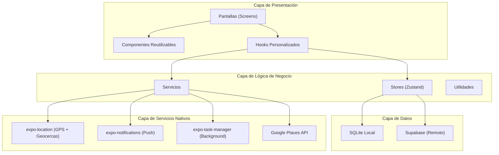
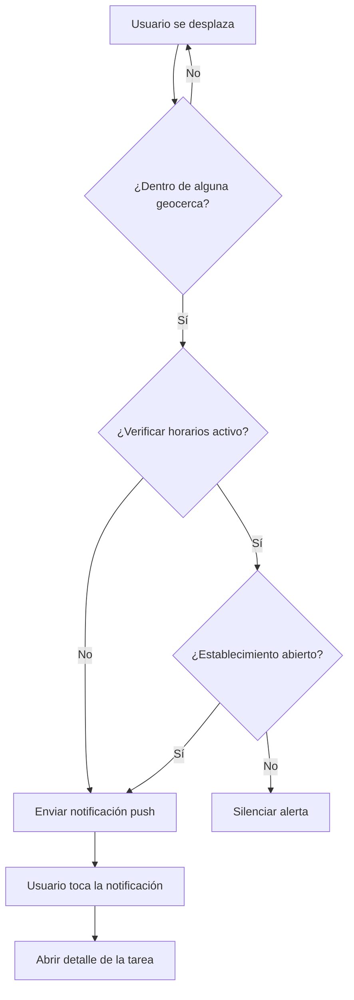
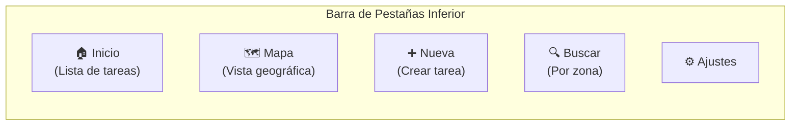
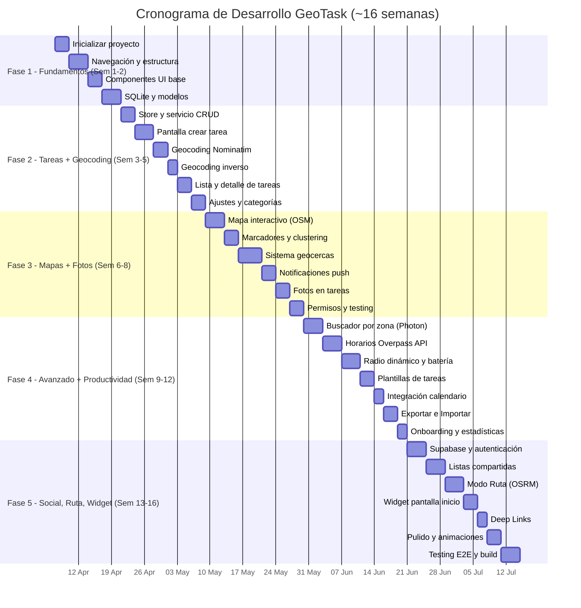

# 📋 Plan de Desarrollo — GeoTask

> **Asistente inteligente de mandados y compras basado en proximidad geográfica**
>
> Aplicación móvil multiplataforma desarrollada con **React Native + Expo**

---

## 1. Visión General del Proyecto

GeoTask es una aplicación móvil que permite al usuario crear tareas y listas de compras asociadas a ubicaciones geográficas concretas. Mediante un sistema de geocercas (*geofencing*), la app envía notificaciones push cuando el usuario se aproxima a un lugar donde tiene pendientes, optimizando así sus desplazamientos cotidianos.

### 1.1 Objetivos Principales

| # | Objetivo | Prioridad |
|---|----------|-----------|
| 1 | Crear tareas geolocalizadas con radio de proximidad configurable | 🔴 Alta |
| 2 | Sistema de alertas push por proximidad (geocercas) | 🔴 Alta |
| 3 | Vista de mapa interactivo con todas las tareas pendientes | 🔴 Alta |
| 4 | Buscador de tareas por zona geográfica | 🟡 Media |
| 5 | Categorización de tareas (compras, papeleo, bancos, etc.) | 🟡 Media |
| 6 | Horarios de apertura inteligentes (integración Google Places) | 🟡 Media |
| 7 | Radio dinámico según modo de transporte | 🟢 Baja |
| 8 | Gestión optimizada de batería | 🟡 Media |
| 9 | Listas compartidas entre usuarios | 🟢 Baja |

---

## 2. Stack Tecnológico

### 2.1 Framework y Lenguaje

| Componente | Tecnología | Justificación |
|------------|------------|---------------|
| **Framework** | React Native + Expo (SDK 52+) | Multiplataforma (iOS/Android) con un solo código base. Expo simplifica enormemente la configuración, el acceso a APIs nativas y el despliegue |
| **Lenguaje** | TypeScript | Tipado estático que mejora la mantenibilidad y facilita el aprendizaje al hacer el código más autodocumentado |
| **Navegación** | Expo Router (basado en archivos) | Navegación declarativa moderna, basada en el sistema de archivos, similar a Next.js |
| **Estado global** | Zustand | Pequeño, intuitivo, sin boilerplate excesivo. Excelente para aprender gestión de estado |
| **Base de datos local** | SQLite (expo-sqlite) | Persistencia offline robusta, ideal para tareas que deben funcionar sin conexión |
| **Estilos** | NativeWind (TailwindCSS para RN) | Consistencia de diseño y velocidad en la maquetación. Opcional: puede sustituirse por StyleSheet nativo si se prefiere máximo control didáctico |

### 2.2 Servicios y APIs Nativos

| Servicio | Librería/API | Uso | Coste |
|----------|-------------|-----|-------|
| **Geolocalización** | `expo-location` | Obtener ubicación del usuario en tiempo real | Gratuito |
| **Geocercas** | `expo-location` (geofencing) + `expo-task-manager` | Monitorización en segundo plano de zonas de proximidad | Gratuito |
| **Notificaciones Push** | `expo-notifications` | Alertas locales al entrar en una geocerca | Gratuito |
| **Mapas** | `react-native-maps` + OpenStreetMap tiles | Visualización del mapa interactivo con marcadores | Gratuito |
| **Geocoding / Búsqueda de lugares** | Nominatim (OpenStreetMap) | Buscar direcciones, geocoding directo e inverso | Gratuito |
| **Horarios de apertura** | Overpass API (OpenStreetMap) | Obtener horarios de establecimientos (`opening_hours`) | Gratuito |
| **Autocompletado de lugares** | Photon (Komoot) | Búsqueda de lugares con autocompletado rápido | Gratuito |
| **Almacenamiento seguro** | `expo-secure-store` | Guardar tokens y preferencias sensibles | Gratuito |
| **Cámara y galería** | `expo-image-picker` | Adjuntar fotos a las tareas | Gratuito |
| **Calendario** | `expo-calendar` | Sincronizar tareas con calendario del dispositivo | Gratuito |
| **Deep links** | Expo Linking + expo-router | Compartir tareas vía enlace directo | Gratuito |

> [!TIP]
> **Política de coste cero en APIs externas.** Se ha elegido deliberadamente un stack basado en servicios gratuitos y open-source. Nominatim, Overpass y Photon son APIs de la comunidad OpenStreetMap sin coste ni límite de API key (solo requieren respetar las políticas de uso razonable: max ~1 req/segundo).

### 2.3 Alternativas Gratuitas vs APIs de Pago

| Necesidad | ❌ Opción de pago | ✅ Alternativa gratuita elegida | Notas |
|-----------|-------------------|-------------------------------|-------|
| Búsqueda de lugares | Google Places API | **Nominatim** (OpenStreetMap) | Sin API key, self-hosteable |
| Autocompletado | Google Places Autocomplete | **Photon** (Komoot) | Basado en OSM, muy rápido |
| Geocoding directo/inverso | Google Geocoding API | **Nominatim** | Coords ↔ Dirección |
| Horarios de apertura | Google Places Details | **Overpass API** (OSM) | Datos comunitarios, buena cobertura en Europa |
| Tiles de mapa | Google Maps | **OpenStreetMap** / **MapTiler Free** | Tiles gratuitas, personalizables |
| Enrutamiento / Ruta óptima | Google Directions API | **OSRM** (Open Source Routing Machine) | Gratuito, self-hosteable, API pública disponible |
| Navegación GPS | Google Maps Navigation | **Delegación al navegador nativo** | Abrir en Apple Maps / Google Maps instalado |

### 2.4 Backend (Fase Futura — Listas Compartidas)

| Componente | Tecnología | Justificación |
|------------|------------|---------------|
| **BaaS** | Supabase | Open-source, ofrece auth, base de datos PostgreSQL y realtime out-of-the-box |
| **Autenticación** | Supabase Auth | Login social (Google, Apple) para compartir listas |
| **Sincronización** | Supabase Realtime | Sincronización en tiempo real de listas compartidas |

> [!TIP]
> Se sugiere **Supabase** como backend por ser open-source, gratuito en su tier inicial, y tener una excelente documentación. Esto facilita el aprendizaje sin costes iniciales.

---

## 3. Arquitectura de la Aplicación

### 3.1 Diagrama de Arquitectura



### 3.2 Estructura de Carpetas

```
GeoTask/
├── app/                          # 📱 Pantallas (Expo Router - file-based routing)
│   ├── _layout.tsx               # Layout raíz de la aplicación
│   ├── index.tsx                 # Pantalla principal: Lista de tareas
│   ├── mapa.tsx                  # Pantalla del mapa interactivo
│   ├── buscar.tsx                # Pantalla de búsqueda por zona
│   ├── ajustes.tsx               # Pantalla de configuración
│   ├── tarea/
│   │   ├── nueva.tsx             # Crear nueva tarea
│   │   ├── [id].tsx              # Detalle/edición de tarea existente
│   │   └── _layout.tsx           # Layout para sección de tareas
│   └── (tabs)/
│       └── _layout.tsx           # Navegación por pestañas inferior
│
├── src/
│   ├── components/               # 🧩 Componentes reutilizables
│   │   ├── ui/                   # Componentes de UI genéricos
│   │   │   ├── Boton.tsx         # Botón personalizado
│   │   │   ├── Tarjeta.tsx       # Card/contenedor visual
│   │   │   ├── EntradaTexto.tsx  # Input de texto estilizado
│   │   │   └── Indicador.tsx     # Loading/spinner
│   │   ├── mapa/                 # Componentes del mapa
│   │   │   ├── MapaInteractivo.tsx
│   │   │   ├── MarcadorTarea.tsx
│   │   │   └── SelectorRadio.tsx
│   │   ├── tarea/                # Componentes de tareas
│   │   │   ├── TarjetaTarea.tsx
│   │   │   ├── ListaTareas.tsx
│   │   │   ├── FormularioTarea.tsx
│   │   │   └── SelectorCategoria.tsx
│   │   └── compartido/           # Componentes compartidos
│   │       ├── Cabecera.tsx
│   │       └── BarraBusqueda.tsx
│   │
│   ├── hooks/                    # 🪝 Hooks personalizados
│   │   ├── useUbicacion.ts       # Hook para gestionar la ubicación
│   │   ├── useGeocercas.ts       # Hook para gestionar geocercas
│   │   ├── useNotificaciones.ts  # Hook para gestionar notificaciones
│   │   ├── useTareas.ts          # Hook CRUD de tareas
│   │   └── useBusqueda.ts        # Hook para búsqueda por zona
│   │
│   ├── stores/                   # 🗄️ Estado global (Zustand)
│   │   ├── useTareaStore.ts      # Store de tareas
│   │   ├── useUbicacionStore.ts  # Store de ubicación
│   │   └── useConfigStore.ts     # Store de configuración/preferencias
│   │
│   ├── services/                 # ⚙️ Servicios y lógica de negocio
│   │   ├── ubicacion.servicio.ts     # Servicio de geolocalización
│   │   ├── geocerca.servicio.ts      # Servicio de geocercas
│   │   ├── notificacion.servicio.ts  # Servicio de notificaciones
│   │   ├── basedatos.servicio.ts     # Servicio de SQLite
│   │   ├── lugares.servicio.ts       # Servicio Google Places API
│   │   └── sincronizacion.servicio.ts # Servicio de sync (fase futura)
│   │
│   ├── models/                   # 📐 Modelos/tipos TypeScript
│   │   ├── tarea.modelo.ts       # Interfaz Tarea
│   │   ├── categoria.modelo.ts   # Interfaz Categoría
│   │   ├── ubicacion.modelo.ts   # Interfaz Ubicación
│   │   └── usuario.modelo.ts     # Interfaz Usuario (fase futura)
│   │
│   ├── utils/                    # 🔧 Utilidades
│   │   ├── constantes.ts         # Constantes globales
│   │   ├── helpers.ts            # Funciones auxiliares
│   │   ├── formato.ts            # Formateo de datos
│   │   └── validacion.ts         # Validación de formularios
│   │
│   ├── config/                   # ⚙️ Configuración
│   │   ├── tema.ts               # Tema visual (colores, tipografía)
│   │   ├── mapa.config.ts        # Configuración del mapa
│   │   └── app.config.ts         # Constantes de la app
│   │
│   └── assets/                   # 🎨 Recursos estáticos
│       ├── iconos/               # Iconos personalizados
│       ├── imagenes/             # Imágenes
│       └── fuentes/              # Fuentes tipográficas
│
├── __tests__/                    # 🧪 Tests
│   ├── components/
│   ├── hooks/
│   ├── services/
│   └── stores/
│
├── app.json                      # Configuración de Expo
├── tsconfig.json                 # Configuración TypeScript
├── package.json
└── README.md
```

> [!NOTE]
> Los nombres de archivos, carpetas, componentes y variables se mantienen **en español** para maximizar el valor didáctico. TypeScript ayuda a que el código sea autodocumentado incluso con nombres en español.

---

## 4. Modelos de Datos

### 4.1 Modelo Principal: Tarea

```typescript
/**
 * Modelo principal de una tarea geolocalizada.
 * Cada tarea representa un "mandado" o acción pendiente
 * vinculada a una ubicación física concreta.
 */
interface Tarea {
  id: string;                    // Identificador único (UUID)
  titulo: string;                // Título corto del mandado
  descripcion: string;           // Descripción detallada
  categoriaId: string;           // Referencia a la categoría
  
  // --- Datos de ubicación ---
  latitud: number;               // Coordenada de latitud
  longitud: number;              // Coordenada de longitud
  direccion: string;             // Dirección legible (calle, número)
  nombreLugar?: string;          // Nombre del establecimiento (opcional)
  placeId?: string;              // ID de Google Places (para horarios)
  
  // --- Configuración de geocerca ---
  radioProximidad: number;       // Radio en metros (200, 500, 1000...)
  geocercaActiva: boolean;       // Si la geocerca está activada
  
  // --- Estado ---
  completada: boolean;           // Si la tarea está completada
  prioridad: 'alta' | 'media' | 'baja';
  
  // --- Metadatos ---
  fechaCreacion: string;         // ISO 8601
  fechaCompletada?: string;      // ISO 8601
  fechaLimite?: string;          // ISO 8601 (opcional)
  
  // --- Listas compartidas (fase futura) ---
  listaId?: string;              // Pertenencia a lista compartida
  creadoPor?: string;            // ID del usuario creador
}
```

### 4.2 Modelo: Categoría

```typescript
/**
 * Categorías para clasificar tareas.
 * Incluye categorías predeterminadas y permite crear personalizadas.
 */
interface Categoria {
  id: string;
  nombre: string;                // Ej: "Compras", "Papeleo", "Bancos"
  icono: string;                 // Nombre del icono (MaterialIcons)
  color: string;                 // Color hexadecimal para el marcador
  esPredeterminada: boolean;     // Si es una categoría del sistema
}
```

### 4.3 Modelo: Configuración del Usuario

```typescript
/**
 * Preferencias del usuario almacenadas localmente.
 */
interface ConfiguracionUsuario {
  radioPreferido: number;        // Radio por defecto en metros
  modoTransporte: 'peatonal' | 'coche' | 'bicicleta' | 'automatico';
  notificacionesSonido: boolean;
  notificacionesVibracion: boolean;
  temaOscuro: boolean;
  verificarHorarios: boolean;    // Consultar si el establecimiento está abierto
  ahorroBateria: boolean;        // Modo de bajo consumo GPS
}
```

### 4.4 Esquema SQLite

```sql
-- Tabla principal de tareas
CREATE TABLE IF NOT EXISTS tareas (
    id TEXT PRIMARY KEY,
    titulo TEXT NOT NULL,
    descripcion TEXT,
    categoria_id TEXT,
    latitud REAL NOT NULL,
    longitud REAL NOT NULL,
    direccion TEXT,
    nombre_lugar TEXT,
    place_id TEXT,
    radio_proximidad INTEGER DEFAULT 500,
    geocerca_activa INTEGER DEFAULT 1,
    completada INTEGER DEFAULT 0,
    prioridad TEXT DEFAULT 'media',
    fecha_creacion TEXT NOT NULL,
    fecha_completada TEXT,
    fecha_limite TEXT,
    lista_id TEXT,
    creado_por TEXT,
    FOREIGN KEY (categoria_id) REFERENCES categorias(id)
);

-- Tabla de categorías
CREATE TABLE IF NOT EXISTS categorias (
    id TEXT PRIMARY KEY,
    nombre TEXT NOT NULL,
    icono TEXT NOT NULL,
    color TEXT NOT NULL,
    es_predeterminada INTEGER DEFAULT 0
);

-- Tabla de configuración
CREATE TABLE IF NOT EXISTS configuracion (
    clave TEXT PRIMARY KEY,
    valor TEXT NOT NULL
);
```

---

## 5. Funcionalidades Detalladas

### 5.1 🗺️ Sistema de Mapas

**Descripción:** Mapa interactivo que muestra todas las tareas pendientes como marcadores geolocalizados, permitiendo una visión global de los mandados.

**Detalles de implementación:**
- Usar `react-native-maps` con tiles de **OpenStreetMap** (gratuito) como proveedor principal
- Opcionalmente Apple Maps en iOS como fallback nativo
- Marcadores personalizados con color según categoría
- Cluster de marcadores cuando hay muchos cercanos
- Círculo visual semi-transparente mostrando el radio de cada geocerca
- Centrado automático en la ubicación del usuario
- Botón para recentrar en la ubicación actual

**Componentes implicados:**
- `MapaInteractivo.tsx` — Componente principal del mapa
- `MarcadorTarea.tsx` — Marcador individual con callout informativo
- `SelectorRadio.tsx` — Control deslizante para ajustar el radio

---

### 5.2 📍 Sistema de Geocercas y Alertas

**Descripción:** Motor de proximidad que monitoriza la ubicación del usuario en segundo plano y dispara notificaciones cuando entra en el radio de una tarea pendiente.

**Detalles de implementación:**
- Registrar geocercas vía `Location.startGeofencingAsync()` de Expo
- Usar `TaskManager.defineTask()` para procesar eventos en background
- Cada tarea activa genera una geocerca con su radio personalizado
- Al entrar en una geocerca → verificar horario (si aplica) → notificación push local
- Límite de geocercas simultáneas: ~20 (limitación de iOS). Implementar rotación inteligente basada en proximidad
- Cooldown entre notificaciones repetidas (no volver a avisar de la misma tarea en X minutos)

**Flujo de la notificación:**



---

### 5.3 🔍 Buscador por Zona

**Descripción:** Permite al usuario consultar qué tareas pendientes tiene en una zona concreta antes de desplazarse (ej. "¿Qué tengo pendiente en Nervión?").

**Detalles de implementación:**
- Campo de búsqueda con autocompletado de zonas/barrios usando **Photon API** (Komoot, basado en OSM, gratuito)
- Al seleccionar una zona, el mapa se centra ahí y muestra solo las tareas de esa área
- Filtro combinado: zona + categoría + estado (pendiente/completada)
- Sugerencias rápidas basadas en zonas frecuentes del usuario
- Geocoding mediante **Nominatim** (OSM) para resolver nombres de zona a coordenadas

---

### 5.4 🏷️ Categorización de Tareas

**Categorías predeterminadas:**

| Categoría | Icono | Color |
|-----------|-------|-------|
| 🛒 Compras | `shopping-cart` | `#4CAF50` |
| 📄 Papeleo | `description` | `#2196F3` |
| 🏦 Bancos | `account-balance` | `#FF9800` |
| 💊 Farmacia | `local-pharmacy` | `#F44336` |
| 📦 Recogidas | `inventory` | `#9C27B0` |
| 🔧 Reparaciones | `build` | `#795548` |
| 🍽️ Restaurantes | `restaurant` | `#E91E63` |
| 📌 Otros | `place` | `#607D8B` |

- El usuario puede crear categorías personalizadas con icono y color
- Cada categoría define el color del marcador en el mapa
- Filtrado rápido por categoría en la lista y en el mapa

---

### 5.5 🕐 Horarios de Apertura Inteligentes

**Descripción:** Integración con **Overpass API** (OpenStreetMap) para verificar si un establecimiento está abierto antes de enviar la notificación de proximidad. Servicio completamente **gratuito**.

**Detalles de implementación:**
- Al crear una tarea, si el usuario busca un lugar, capturar el `osm_id` (identificador de OpenStreetMap)
- Consultar la **Overpass API** para obtener el tag `opening_hours` del establecimiento
- Parsear los horarios con la librería `opening_hours` (npm) que interpreta el formato estándar OSM
- Si está cerrado: suprimir notificación y mostrar info de cuándo abre
- Cachear horarios localmente en SQLite (TTL: 7 días, ya que raramente cambian)
- Funcionalidad activable/desactivable en ajustes
- **Fallback:** Si el establecimiento no tiene horarios en OSM, el usuario puede introducirlos manualmente

**Ejemplo de query Overpass:**
```
[out:json];
node(around:50, {lat}, {lon})["opening_hours"];
out body;
```

> [!NOTE]
> Overpass API es gratuita y no requiere API key. La cobertura de horarios en OSM es buena en Europa, especialmente en España. Para establecimientos sin datos, se ofrece entrada manual como fallback.

---

### 5.6 🚗 Radio Dinámico según Transporte

**Descripción:** Ajuste automático del radio de notificación según la velocidad de desplazamiento del usuario.

**Lógica:**

| Velocidad detectada | Modo inferido | Radio sugerido |
|---------------------|---------------|----------------|
| 0-6 km/h | Peatonal | Radio configurado (200-500m) |
| 6-25 km/h | Bicicleta | Radio × 1.5 |
| 25-120 km/h | Coche | Radio × 3 |

- Usar `Location.watchPositionAsync()` para calcular velocidad
- El usuario puede fijar el modo manualmente o dejarlo en "automático"
- Actualizar las geocercas dinámicamente cuando cambia el modo

---

### 5.7 🔋 Gestión Optimizada de Batería

**Estrategias de bajo consumo:**
- **Geofencing nativo:** Delegar al sistema operativo (iOS/Android) la monitorización de geocercas, que es mucho más eficiente que GPS continuo
- **Detección de actividad:** Usar `expo-location` con `accuracy: Location.Accuracy.Balanced` por defecto
- **Modo reposo:** Si el dispositivo está estacionario >15 min, reducir frecuencia de actualización
- **Batch de geocercas:** Agrupar tareas cercanas en una sola geocerca mayor
- **Indicador de batería:** Mostrar al usuario el impacto estimado en la batería

---

### 5.8 📷 Fotos en Tareas

**Descripción:** Permitir adjuntar fotografías a las tareas para tener una referencia visual del producto, documento o lugar.

**Detalles de implementación:**
- Usar `expo-image-picker` para capturar foto o seleccionar de galería
- Almacenamiento local de imágenes en el sistema de archivos del dispositivo
- Compresión automática de imágenes (max 1024px, calidad 80%) para gestionar espacio
- Vista previa en miniatura en la tarjeta de tarea y vista ampliada en el detalle
- Máximo 3 fotos por tarea
- En fase futura (listas compartidas): subir fotos a Supabase Storage

---

### 5.9 🔄 Geocoding Inverso

**Descripción:** Al tocar un punto en el mapa, resolver automáticamente el nombre de la calle, barrio y ciudad usando **Nominatim** (gratuito).

**Detalles de implementación:**
- Consultar `https://nominatim.openstreetmap.org/reverse?lat={lat}&lon={lon}&format=json`
- Extraer: `road`, `suburb`, `city`, `postcode` de la respuesta
- Autorellenar el campo de dirección al crear una tarea tocando el mapa
- Debounce de 500ms para evitar llamadas excesivas al arrastrar el pin
- Cachear resultados recientes en memoria para zonas ya consultadas

---

### 5.10 📋 Plantillas de Tareas

**Descripción:** Tareas recurrentes que se recrean automáticamente según un patrón temporal (ej. "Comprar pan" cada lunes).

**Detalles de implementación:**
- Modelo `PlantillaTarea` con campos adicionales: `frecuencia`, `diasSemana`, `horaRecordatorio`
- Frecuencias soportadas: diaria, semanal, quincenal, mensual, personalizada
- Al completar una tarea recurrente, se genera automáticamente la siguiente instancia
- Tabla SQLite dedicada `plantillas_tareas` vinculada con `tareas`
- Vista de gestión de plantillas en Ajustes
- Indicador visual en la tarjeta: icono de recurrencia (🔄)

---

### 5.11 📅 Integración con Calendarios

**Descripción:** Sincronizar tareas con fecha límite al calendario nativo del dispositivo usando `expo-calendar`.

**Detalles de implementación:**
- Crear un calendario dedicado "GeoTask" en el dispositivo
- Al crear una tarea con fecha límite → crear evento en el calendario
- Al completar/eliminar tarea → eliminar evento del calendario
- Recordatorios del calendario como canal complementario a las geocercas
- Permiso de calendario solicitado solo al activar esta función
- Toggle en Ajustes para activar/desactivar sincronización

---

### 5.12 📤 Exportar/Importar Tareas

**Descripción:** Exportar tareas como JSON o CSV para backup, migración o compartir entre dispositivos.

**Detalles de implementación:**
- Exportar: Generar archivo JSON/CSV con todas las tareas (o filtrar por categoría/estado)
- Importar: Leer archivo JSON/CSV y crear tareas en lote
- Compartir el archivo exportado vía `expo-sharing` (AirDrop, email, WhatsApp, etc.)
- Formato JSON incluye metadatos: versión del esquema, fecha de exportación
- Validación de integridad al importar (campos obligatorios, coordenadas válidas)

---

### 5.13 🗺️ Modo Ruta

**Descripción:** Sugerir un orden óptimo para completar varias tareas en una salida, con posibilidad de navegar entre ellas.

**Detalles de implementación:**
- Usar **OSRM** (Open Source Routing Machine, gratuito) para calcular rutas entre puntos
- Algoritmo de optimización de ruta tipo TSP (Travelling Salesman Problem) simplificado
- Visualizar ruta en el mapa con polyline y orden numerado en cada marcador
- Botón "Iniciar navegación" → abrir la app de navegación nativa (Apple Maps / Google Maps) con waypoints
- Estimar tiempo total y distancia de la ruta completa
- Filtrar qué tareas incluir en la ruta (por categoría, prioridad, o selección manual)

---

### 5.14 📱 Widget para Pantalla de Inicio

**Descripción:** Widget nativo (iOS/Android) que muestre las tareas más cercanas sin necesidad de abrir la app.

**Detalles de implementación:**
- Usar `react-native-widget-extension` (iOS) y `react-native-android-widget` (Android)
- Widget pequeño (2×2): muestra las 2-3 tareas más cercanas con nombre y distancia
- Widget mediano (4×2): añade categoría, icono y botón de completar
- Actualización del widget cada 15 minutos (limitación del sistema) o al cambiar de ubicación significativamente
- Tap en tarea del widget → abre la app en el detalle de esa tarea (deep link)

---

### 5.15 🔗 Deep Links

**Descripción:** Compartir tareas vía enlace que se abra directamente en la app.

**Detalles de implementación:**
- Esquema de URL: `geotask://tarea/{id}` (deep link nativo)
- URL universal: `https://geotask.app/tarea/{id}` (para navegadores)
- Configurar con Expo Linking y expo-router para manejar rutas entrantes
- Al compartir una tarea → generar enlace + preview con título y ubicación
- Si el receptor no tiene la app → redirigir a la tienda correspondiente
- Soportar también enlaces a listas compartidas: `geotask://lista/{id}`

---

### 5.16 👥 Listas Compartidas (Fase Futura)

**Descripción:** Permitir que varios usuarios compartan una lista de tareas (ej. compras del hogar para una pareja).

**Detalles** (para la fase 5 del desarrollo):
- Autenticación con Supabase Auth (Google / Apple Sign-In)
- Base de datos remota en Supabase (PostgreSQL)
- Sincronización en tiempo real via Supabase Realtime
- Sistema de invitaciones por enlace o código (deep links)
- Indicador de quién creó/completó cada tarea
- Modo offline-first con sincronización al reconectar

---

## 6. Diseño de Interfaz (UI/UX)

### 6.1 Navegación Principal



### 6.2 Pantallas Principales

| Pantalla | Descripción | Elementos clave |
|----------|-------------|-----------------|
| **Inicio** | Lista de tareas pendientes agrupadas | Cards de tareas, filtros por categoría, swipe para completar |
| **Mapa** | Mapa a pantalla completa | Marcadores, radio visual, ubicación del usuario, cluster |
| **Nueva Tarea** | Formulario de creación | Selector de ubicación en mapa, buscador de lugar, radio slider, categoría |
| **Detalle Tarea** | Vista y edición de una tarea | Mapa pequeño, estado, historial, botón completar |
| **Buscar** | Búsqueda por zona | Autocompletado de zonas, resultados filtrados, mini-mapa |
| **Ajustes** | Configuración de la app | Radio por defecto, modo transporte, notificaciones, tema |

### 6.3 Paleta de Colores Propuesta

| Rol | Color | Uso |
|-----|-------|-----|
| Primario | `#6366F1` (Indigo) | Botones principales, header |
| Secundario | `#EC4899` (Rosa) | Acentos, badges |
| Fondo claro | `#F8FAFC` | Fondo principal (modo claro) |
| Fondo oscuro | `#0F172A` | Fondo principal (modo oscuro) |
| Superficie | `#1E293B` | Tarjetas (modo oscuro) |
| Éxito | `#22C55E` | Tarea completada |
| Alerta | `#F59E0B` | Advertencias |
| Error | `#EF4444` | Errores |

---

## 7. Fases de Desarrollo

### Fase 1: Fundamentos (Semanas 1-2)

> **Objetivo:** Configurar el proyecto y crear la estructura base con navegación funcional.

| # | Tarea | Descripción |
|---|-------|-------------|
| 1.1 | Inicializar proyecto Expo | `npx create-expo-app@latest GeoTask --template blank-typescript` |
| 1.2 | Configurar TypeScript | tsconfig con paths aliases (`@/components`, `@/hooks`, etc.) |
| 1.3 | Instalar dependencias base | expo-router, react-native-maps, expo-location, zustand, expo-sqlite, expo-image-picker, expo-calendar, expo-sharing |
| 1.4 | Crear estructura de carpetas | Según la sección 3.2 de este plan |
| 1.5 | Configurar Expo Router | Navegación por pestañas con las 5 secciones |
| 1.6 | Definir sistema de diseño | Tema, colores, tipografía, componentes UI base |
| 1.7 | Crear componentes UI base | Boton, Tarjeta, EntradaTexto, Indicador |
| 1.8 | Configurar SQLite | Crear base de datos, tablas (incluida `plantillas_tareas`) y servicio CRUD |
| 1.9 | Implementar modelos TypeScript | Interfaces y tipos según sección 4 (incluidos PlantillaTarea y Export) |
| 1.10 | Insertar datos semilla | Categorías predeterminadas |

**Entregable:** App navegable con componentes visuales base y BD local inicializada.

---

### Fase 2: Gestión de Tareas (Semanas 3-5)

> **Objetivo:** CRUD completo de tareas con persistencia local. Incluye geocoding inverso gratuito.

| # | Tarea | Descripción |
|---|-------|-------------|
| 2.1 | Crear `useTareaStore` | Store Zustand con CRUD: crear, leer, actualizar, eliminar, completar |
| 2.2 | Implementar `basedatos.servicio.ts` | Capa de acceso a SQLite con operaciones CRUD |
| 2.3 | Pantalla Lista de Tareas (Inicio) | FlatList con TarjetaTarea, filtros, swipe-to-complete |
| 2.4 | Pantalla Crear Tarea | Formulario completo con validación |
| 2.5 | Selector de ubicación en mapa | Componente para seleccionar punto en el mapa |
| 2.6 | Buscador de lugares (Nominatim) | Buscar direcciones con **Nominatim** (OSM, gratuito) en vez de Google Geocoding |
| 2.7 | 🆕 Geocoding inverso (Nominatim) | Al tocar el mapa, resolver automáticamente calle/barrio/ciudad vía Nominatim reverse |
| 2.8 | Selector de categoría | Picker visual con iconos y colores |
| 2.9 | Selector de radio | Slider visual (200m — 2000m) con preview en mapa |
| 2.10 | Pantalla Detalle/Edición | Ver y editar tarea existente |
| 2.11 | Pantalla de Ajustes | Preferencias básicas (radio por defecto, tema) |

**Entregable:** App funcional con gestión completa de tareas y geocoding gratuito, sin geofencing aún.

---

### Fase 3: Mapas, Geolocalización y Fotos (Semanas 6-8)

> **Objetivo:** Mapa interactivo, sistema de geocercas con notificaciones, y fotos en tareas.

| # | Tarea | Descripción |
|---|-------|-------------|
| 3.1 | Pantalla Mapa completa | Mapa a pantalla completa con tiles de OpenStreetMap |
| 3.2 | Marcadores personalizados | Color por categoría, callout con info de tarea |
| 3.3 | Clustering de marcadores | Agrupar marcadores cercanos automáticamente |
| 3.4 | Visualización de radio | Círculos semi-transparentes para cada geocerca |
| 3.5 | Hook `useUbicacion` | Obtener y monitorizar la ubicación del usuario |
| 3.6 | Servicio de geocercas | Registrar/desregistrar geocercas con expo-location |
| 3.7 | Procesamiento background | TaskManager para procesar entradas en geocercas |
| 3.8 | Notificaciones locales | Configurar expo-notifications para alertas de proximidad |
| 3.9 | Conectar geocercas ↔ notificaciones | Flujo completo: entrar en zona → notificación |
| 3.10 | Permisos de ubicación | Solicitud de permisos con UI explicativa (background location) |
| 3.11 | Cooldown de notificaciones | Evitar notificaciones repetitivas para la misma tarea |
| 3.12 | 🆕 Fotos en tareas | Captura/galería con `expo-image-picker`, compresión, almacenamiento local, preview |
| 3.13 | Pruebas con ubicación simulada | Configurar mock de ubicación para testing |

**Entregable:** Sistema de geofencing funcional con notificaciones, fotos en tareas, y mapa con tiles gratuitos.

---

### Fase 4: Búsqueda, Funcionalidades Avanzadas y Productividad (Semanas 9-12)

> **Objetivo:** Buscador por zona, horarios inteligentes (gratuitos), plantillas, calendario, exportación.

| # | Tarea | Descripción |
|---|-------|-------------|
| 4.1 | Pantalla Buscar | Buscador de zonas con autocompletado vía **Photon API** (OSM, gratuito) |
| 4.2 | Filtro geográfico | Mostrar solo tareas dentro de una zona seleccionada |
| 4.3 | Filtros combinados | Zona + categoría + estado |
| 4.4 | Integración Overpass API (OSM) | Servicio gratuito para consultar horarios de apertura (`opening_hours`) |
| 4.5 | Verificación pre-notificación | Comprobar si el establecimiento está abierto antes de avisar |
| 4.6 | Caché de horarios | Caché en SQLite con TTL de 7 días |
| 4.7 | Radio dinámico | Detectar velocidad y ajustar radio automáticamente |
| 4.8 | Optimización de batería | Implementar estrategias de bajo consumo (sección 5.7) |
| 4.9 | 🆕 Plantillas de tareas | Modelo, CRUD, frecuencias (diaria/semanal/mensual), regeneración automática |
| 4.10 | 🆕 Integración con calendarios | Sincronizar tareas con fecha límite al calendario nativo vía `expo-calendar` |
| 4.11 | 🆕 Exportar/Importar | Exportar tareas como JSON/CSV, importar con validación, compartir vía `expo-sharing` |
| 4.12 | Estadísticas básicas | Tareas completadas, zonas más frecuentes, rachas |
| 4.13 | Onboarding | Tutorial inicial para nuevos usuarios |

**Entregable:** Búsqueda funcional, horarios gratuitos, plantillas recurrentes, sincronización calendario, exportación.

---

### Fase 5: Funcionalidades Sociales, Ruta, Widget y Pulido (Semanas 13-16)

> **Objetivo:** Listas compartidas, modo ruta, widget nativo, deep links, pulido visual y preparación para producción.

| # | Tarea | Descripción |
|---|-------|-------------|
| 5.1 | Configurar Supabase | Proyecto, tablas, políticas RLS |
| 5.2 | Autenticación | Login con Google/Apple via Supabase Auth |
| 5.3 | Sincronización de listas | Subir/descargar listas compartidas |
| 5.4 | Invitaciones | Sistema de invitación por enlace/código |
| 5.5 | Tiempo real | Actualización en vivo de listas compartidas |
| 5.6 | Modo offline-first | Cola de cambios pendientes para sincronización |
| 5.7 | 🆕 Modo Ruta (OSRM) | Ruta óptima entre tareas usando **OSRM** (gratuito), polyline en mapa, navegación nativa |
| 5.8 | 🆕 Widget pantalla de inicio | Widget nativo iOS/Android con tareas cercanas (react-native-widget-extension) |
| 5.9 | 🆕 Deep Links | Esquema `geotask://`, URL universales, compartir tareas/listas por enlace |
| 5.10 | Animaciones y transiciones | Pulir UX con animaciones sutiles (react-native-reanimated) |
| 5.11 | Modo oscuro completo | Verificar diseño en ambos modos |
| 5.12 | Accesibilidad | Labels, contraste, tamaños de toque |
| 5.13 | Pruebas End-to-End | Tests con Detox o similar |
| 5.14 | Preparar assets de tienda | Iconos, capturas, descripciones |
| 5.15 | Build de producción | EAS Build para iOS y Android |

**Entregable:** App completa con ruta óptima, widget, deep links, listas compartidas. Lista para publicación.

---

## 8. Estrategia de Comentarios Didácticos

> [!IMPORTANT]
> Todos los comentarios del código serán en **español**. El objetivo es que cualquier persona hispanohablante que lea el código pueda comprender no solo QUÉ hace el código, sino POR QUÉ lo hace así.

### 8.1 Tipos de Comentarios

Se utilizarán cuatro niveles de comentarios:

#### 1️⃣ Comentario de archivo (cabecera)
```typescript
/**
 * ============================================================
 * 📍 Servicio de Geocercas — geocerca.servicio.ts
 * ============================================================
 * 
 * Este servicio gestiona el registro y monitorización de geocercas
 * (zonas circulares alrededor de un punto geográfico).
 * 
 * ¿Qué es una geocerca?
 * Una geocerca es una zona virtual definida por una coordenada
 * central (lat/lng) y un radio en metros. Cuando el dispositivo
 * del usuario entra o sale de esta zona, el sistema operativo
 * genera un evento que nuestra app procesa.
 * 
 * Dependencias clave:
 * - expo-location: Proporciona la API de geofencing nativa
 * - expo-task-manager: Permite procesar eventos en segundo plano
 * 
 * @autor GeoTask
 * @version 1.0.0
 * ============================================================
 */
```

#### 2️⃣ Comentario de sección (bloques lógicos)
```typescript
// ──────────────────────────────────────────────
// 📌 SECCIÓN: Registro de geocercas
// Aquí definimos las funciones que crean y eliminan
// las zonas de monitorización en el sistema operativo.
// ──────────────────────────────────────────────
```

#### 3️⃣ Comentario de función (JSDoc en español)
```typescript
/**
 * Registra una nueva geocerca en el sistema operativo.
 * 
 * Esta función crea una zona circular invisible alrededor de la
 * ubicación de una tarea. Cuando el usuario entre en esta zona,
 * el sistema operativo avisará a nuestra app (incluso si está cerrada).
 * 
 * ⚠️ Importante: iOS tiene un límite de ~20 geocercas simultáneas.
 * Si se supera este límite, debemos rotar las geocercas según proximidad.
 * 
 * @param tarea - La tarea cuya ubicación queremos monitorizar
 * @returns Promise<boolean> - true si se registró correctamente
 * 
 * @ejemplo
 * const exito = await registrarGeocerca(miTarea);
 * if (exito) {
 *   console.log('Geocerca activa para:', miTarea.titulo);
 * }
 */
```

#### 4️⃣ Comentario inline (línea a línea donde sea necesario)
```typescript
// Solicitamos permiso de ubicación en segundo plano.
// Este permiso es CRUCIAL para que las geocercas funcionen
// cuando la app no está abierta. Sin él, solo funciona en primer plano.
const { status } = await Location.requestBackgroundPermissionsAsync();

// Verificamos que el permiso fue concedido.
// En iOS, el usuario puede elegir "Solo mientras uso la app",
// lo cual NO es suficiente para nuestro caso de uso.
if (status !== 'granted') {
  // Mostramos una explicación de por qué necesitamos este permiso
  mostrarDialogoPermiso();
  return false;
}
```

### 8.2 Reglas de Comentarios

1. **Idioma:** Siempre en español, sin excepción
2. **Verbosidad:** Favorecer la explicación sobre la brevedad
3. **Conceptos:** Explicar conceptos técnicos la primera vez que aparecen (ej. "¿Qué es una geocerca?")
4. **Decisiones:** Documentar el PORQUÉ de las decisiones de diseño, no solo el QUÉ
5. **Advertencias:** Usar emojis para alertas: ⚠️ (cuidado), 📌 (importante), 💡 (tip), 🐛 (bug conocido)
6. **Referencias:** Enlazar a documentación oficial cuando sea relevante
7. **TODOs:** Marcar mejoras futuras con `// TODO(didáctico):` para distinguirlos

---

## 9. Plan de Testing

### 9.1 Tests Unitarios

| Qué testar | Herramienta | Qué validar |
|-------------|-------------|-------------|
| Stores (Zustand) | Jest | CRUD de tareas, cambios de estado |
| Servicios | Jest | Lógica de geocercas, cálculos de distancia |
| Utilidades | Jest | Formateo, validación, helpers |
| Hooks | React Native Testing Library | Ciclo de vida, estados |

### 9.2 Tests de Integración

| Qué testar | Herramienta | Qué validar |
|-------------|-------------|-------------|
| Pantallas | React Native Testing Library | Renderizado, interacción |
| SQLite | Jest + expo-sqlite | Persistencia, queries |
| Navegación | Expo Router testing | Rutas, parámetros |

### 9.3 Tests E2E

| Qué testar | Herramienta | Qué validar |
|-------------|-------------|-------------|
| Flujos completos | Detox / Maestro | Crear tarea → ver en mapa → completar |
| Geolocalización | Mock de ubicación | Simular entrada en geocerca |


---

## 11. Requisitos Previos para el Desarrollo

### 11.1 Entorno de Desarrollo

- **Node.js** 18+ (LTS)
- **npm** o **yarn** (preferiblemente npm para consistencia con Expo)
- **Expo CLI** (vía npx, no instalación global)
- **Android Studio** (para emulador Android y build nativo)
- **Xcode** (para simulador iOS — solo macOS)
- **VS Code** con extensiones: ESLint, Prettier, React Native Tools, TypeScript

### 11.2 Cuentas y API Keys

| Servicio | Necesario en | Propósito | Coste |
|----------|-------------|-----------|-------|
| **Expo** (expo.dev) | Fase 1 | Builds en la nube (EAS), OTA updates | Gratuito (tier free) |
| **Nominatim** (OSM) | Fase 2 | Geocoding directo e inverso | Gratuito (sin API key) |
| **Photon** (Komoot) | Fase 4 | Autocompletado de lugares | Gratuito (sin API key) |
| **Overpass API** (OSM) | Fase 4 | Horarios de apertura | Gratuito (sin API key) |
| **OSRM** | Fase 5 | Cálculo de rutas óptimas | Gratuito (sin API key) |
| **Supabase** | Fase 5 | Backend para listas compartidas | Gratuito (tier free) |
| **Apple Developer** | Fase 5 | Publicación en App Store | 99€/año |
| **Google Play Console** | Fase 5 | Publicación en Google Play | 25$ (único pago) |

> [!TIP]
> **Ninguna API externa requiere pago ni API key** para el desarrollo. Los únicos costes son las cuentas de desarrollador para publicar en las tiendas.

---

## 12. Cronograma Visual



---

## 13. Resumen Ejecutivo

| Aspecto | Detalle |
|---------|---------|
| **Nombre** | GeoTask |
| **Tipo** | Aplicación móvil multiplataforma |
| **Framework** | React Native + Expo |
| **Lenguaje** | TypeScript |
| **Plataformas** | iOS + Android |
| **Fases** | 5 fases (~16 semanas) |
| **APIs externas** | 100% gratuitas (Nominatim, Photon, Overpass, OSRM — todas OpenStreetMap) |
| **Comentarios** | Extensos, en español, con enfoque didáctico |
| **Funcionalidad core** | Tareas geolocalizadas con notificaciones por proximidad |
| **Diferenciador** | Horarios gratuitos + radio dinámico + plantillas + modo ruta + widget + listas compartidas |


---

> [!NOTE]
> Este plan es un documento vivo. Se irá actualizando conforme avance el desarrollo y se tomen decisiones sobre las sugerencias de mejora propuestas.

> [!IMPORTANT]
> En cada uno de los pasos, si sugen dudas o hay que contestar a preguntas, me refiero al desarrollo de la app, debes notificar estas preguntas a ntfy.sh al topic 'geo_task_chanlusoft' y yo te responderé a la mayor brevedad posible.
